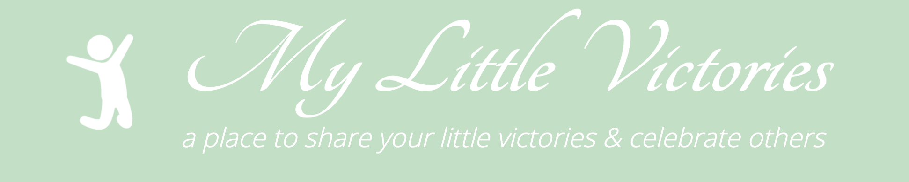

- [About our app.](#about-our-app)
- [Installation & Usage.](#installation--usage)
  - [Usage](#usage)
  - [Installation](#installation)
- [Technologies Used.](#technologies-used)
  - [Frontend](#frontend)
  - [Backend](#backend)
  - [Testing](#testing)
  - [Development](#development)
  - [Misc](#misc)
- [Process.](#process)
- [Wins & Challenges.](#wins--challenges)
  - [Wins 💪🏻](#wins-)
  - [Challenges 😮‍💨](#challenges-)
- [Known Bugs.](#known-bugs)
- [Potential Future Features.](#potential-future-features)

### About our app.
My Little Victories is an anonymous blogging and social media sharing platform that allows users to share the small things that make them feel good. It's also a space to celebrate the achievements of others.

This project was created for our bootcamp and was both timed and team based.

### Installation & Usage.
#### Usage
The site is hosted [here](https://my-little-victories.netlify.app/).
and our API is hosted [here](https://my-little-victories.herokuapp.com/posts).

#### Installation
- Clone or download this repo
- In your terminal navigate to `1st-portfolio-project`.
- Run npm install to install dependencies.

### Technologies Used.
My Little Victories was created with the following technologies.

#### Frontend
- HTML CSS JavaScript
  
#### Backend
- NodeJS
- [Express](https://expressjs.com/)
- [Axios](https://www.npmjs.com/package/axios)
- [Giphy Api](https://developers.giphy.com/)
- [dotenv](https://www.npmjs.com/package/dotenv)
- [Cors](https://expressjs.com/en/resources/middleware/cors.html)
  
#### Testing
- [Jest](https://jestjs.io/)
- [Supertest](https://github.com/visionmedia/supertest)
  
#### Development
- [Nodemon](https://www.npmjs.com/package/nodemon)
- [Watchify](https://www.npmjs.com/package/watchify)
- [Concurrently](https://www.npmjs.com/package/concurrently)
  
#### Misc
- [Figma](https://www.figma.com/) - Design.
- [Slack](https://slack.com/) - Collaboration.
- [Github](https://github.com/) - Distributed Development.

### Process.

### Wins & Challenges.
#### Wins 💪🏻
- We have a function app that meets all requirements.
- Our ability to quickly adapt to an agile working style when our initial plan for development had to change.

#### Challenges 😮‍💨
- Early in the project a member of our team experienced severe computer issues and was unable to contribute to our codebase for a large part of the week. However as a team we quickly pivoted and adapted our working style to accommodate for this.
- Time constraints were tough, especially being a person down.

### Known Bugs.
Any currently known bugs can been seen or reported [here](https://github.com/Poligera/1st-portfolio-project/issues)

### Potential Future Features.
When we started the development process we established a set of 'nice to haves' which would be implemented if time allowed. This list can be found on our project board [here](https://github.com/Poligera/1st-portfolio-project/projects/1)

